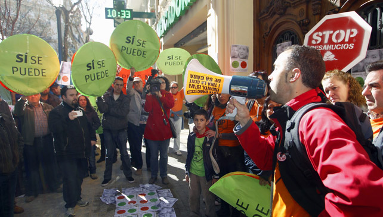
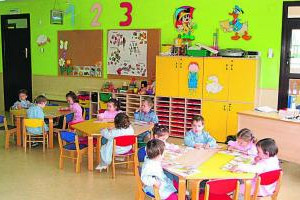

http://auditoriaciudadana.net  
[@AuditoriaMadrid](https://twitter.com/AuditoriaMadrid)

--- &vertical  

## El concepto de Ilegitimidad
No es un concepto jurídico, sino **político**.

Un concepto que evoluciona con el contexto social y que cada población debe construir. 

***

## El concepto de ilegitimidad en perspectiva histórica
### Henry David Thoreau y la desobediencia civil

<table class="centercontent">
  <tr>
    <td>
      
    </td>
    <td>
      
        
      
    </td>
  </tr>
</table>

***

### La esclavitud y los movimientos abolicionistas

***

### Los derechos de la mujer y el movimiento sufragista

***

### Los derechos laborales y el movimiento obrero

***

### La lucha por los derechos civiles y de liberación nacional

<table class="centercontent">
  <tr>
    <td>
      
        
      
    </td>
    <td>
      
        
      
    </td>
  </tr>
</table>

***

### Los desahucios y la PAH

***

### La deuda y el movimiento anti-deuda

--- ds:alert &vertical

## Deuda Ilegítima

> Aquella contraída sin contar con la población y que vulnera derechos humanos, sociales, económicos, culturales, medioambientales o de género de una parte de la población en favor de los intereses de una minoría.

***

## Deuda Ilegal

> Aquella en cuya contratación hubo fraude de ley, bien porque no se siguieron los procedimientos legales apropiados, incluidos aquellos relativos a la autoridad para firmar o aprobar préstamos, títulos de deuda o garantías por parte de sectores o sucursales representantes del gobierno del Estado prestatario, bien porque hubo una clara mala conducta del prestamista, que incluya sobornos, coerción o una influencia indebida, o porque implicara condiciones que contravinieran leyes nacionales o internacionales, o las políticas públicas.

***

## Deuda Odiosa

> Aquella contraída por un Estado de manera no democrática e injusta en contra de los intereses legítimos de la población, y que los prestamistas conocían o deberían haber conocido que se estaba incurriendo en una violación de los principios democráticos —consentimiento, participación, transparencia y responsabilidad—.

***

## Deuda Insostenible

> Una deuda cuyo pago implica para el Estado serias dificultades para cumplir con sus obligaciones referentes a los derechos humanos básicos, tales como los relacionados con la salud, la educación, el agua, las redes de saneamiento y la vivienda digna, o para invertir en infraestructuras públicas y programas necesarios para el desarrollo económico y social, provocando un deterioro en las condiciones de vida de la población.

***

## Deuda Ilegítima
<iframe width="853" height="480" src="https://www.youtube.com/embed/y9ZUc_A0vWM" frameborder="0" allowfullscreen></iframe>

--- &vertical

## La deuda del Ayuntamiento de Madrid

<iframe src=' assets/fig/deuda_madrid-1.html ' scrolling='no' frameBorder='0' seamless class='rChart nvd3 ' id=iframe- chart1eea5187de ></iframe> 
Fuente: Elaboración propia a partir de datos del Banco de España

***

## ¿A quién debemos?

<iframe src=' assets/fig/acreedores_madrid-1.html ' scrolling='no' frameBorder='0' seamless class='rChart nvd3 ' id=iframe- chart1eea4bc2721c ></iframe> 
Fuente: Elaboración propia a partir de datos del Banco de España

--- &vertical

## ¿Cómo se ha generado la deuda?

Coste de algunos "elefantes blancos" (millones €)
<table class='colortable' style='border-collapse: collapse; margin-top: 1em; margin-bottom: 1em;' >
<thead>
<tr>
<th style='border-bottom: 1px solid grey; border-top: 2px solid grey; text-align: center;'>Infraestructura</th>
<th style='border-bottom: 1px solid grey; border-top: 2px solid grey; text-align: center;'>Presupuesto inicial</th>
<th style='border-bottom: 1px solid grey; border-top: 2px solid grey; text-align: center;'>Coste final</th>
<th style='border-bottom: 1px solid grey; border-top: 2px solid grey; text-align: center;'>Desviación</th>
</tr>
</thead>
<tbody>
<tr>
<td nowrap="nowrap";  style='text-align: left;'>M30</td>
<td nowrap="nowrap";  style='text-align: right;'>1700</td>
<td nowrap="nowrap";  style='text-align: right;'>10406</td>
<td nowrap="nowrap";  style='text-align: right;'>8706</td>
</tr>
<tr>
<td nowrap="nowrap";  style='text-align: left;'>Palacio de Cibeles</td>
<td nowrap="nowrap";  style='text-align: right;'>40</td>
<td nowrap="nowrap";  style='text-align: right;'>120+328</td>
<td nowrap="nowrap";  style='text-align: right;'>408</td>
</tr>
<tr>
<td nowrap="nowrap";  style='text-align: left;'>Centro Acuático</td>
<td nowrap="nowrap";  style='text-align: right;'></td>
<td nowrap="nowrap";  style='text-align: right;'>54,5</td>
<td nowrap="nowrap";  style='text-align: right;'>54,5</td>
</tr>
<tr>
<td nowrap="nowrap";  style='text-align: left;'>Caja Mágica</td>
<td nowrap="nowrap";  style='text-align: right;'>140</td>
<td nowrap="nowrap";  style='text-align: right;'>294</td>
<td nowrap="nowrap";  style='text-align: right;'>154</td>
</tr>
<tr>
<td nowrap="nowrap";  style='border-bottom: 2px solid grey; text-align: left;'>TOTAL</td>
<td nowrap="nowrap";  style='border-bottom: 2px solid grey; text-align: right;'>1880</td>
<td nowrap="nowrap";  style='border-bottom: 2px solid grey; text-align: right;'>11202,5</td>
<td nowrap="nowrap";  style='border-bottom: 2px solid grey; text-align: right;'>9322,5</td>
</tr>
</tbody>
<tfoot><tr><td nowrap="nowrap";  colspan='4'>
Fuente: El Confidencial y El País</td></tr></tfoot>
</table>

<!-- Note

- El precio de la licitación de la M-30 se elevó hasta los 4.250 millones de €.El coste de los 10.406 millones de euros incluye los intereses a pagar hasta 2040.
- La obra del centro acuático está parada desde 2010 por motivos económicos. Presupuesto inicial de 137 millones de euros.
- FCC exige 33 millones más debido a sobrecoste adicional de la caja mágica.
-->

*** 

## El caso de la Caja Mágica

***

## El caso de la Caja Mágica
### Indicios de ilegitimidad

- Sobrecoste: 154 millones €.
- Coste mantenimiento: 1,35 millones € /año &rArr; Pérdidas anuales.
- Concebida para el deporte de élite.
- Sólo se usa para el open de tenis de Madrid. 
- Concesión a empresas privadas para gimnasio y otros eventos ([MOMO Spot Club](http://momosportsclub.com/momo-caja-magica))
- Falta de instalaciones deportivas de base en el distrito. 

***

## El coste de oportunidad 

Con 154 millones de € se podría haber construido: 

<table class="plain">
<tr class="fragment">
  <td style="vertical-align: middle">5 polideportivos</td>
  <td>
      
      
      
      
  </td>
</tr>
<tr class="fragment">
  <td style="vertical-align: middle">5 bibliotecas</td>
  <td>
      
      
      
      
  </td>
</tr>
<tr class="fragment">
  <td style="vertical-align: middle">5 escuelas infantiles</td>
  <td>
      
      
      
      
  </td>
</tr>
<tr class="fragment">
  <td style="vertical-align: middle">5 Centros de mayores</td>
  <td>
      
      
      
      
  </td>
</tr>
<tr class="fragment">
  <td style="vertical-align: middle">1 parque de 30 Ha</td>
  <td></td>
</tr>
</table>

***

## El caso del soterramiento de la M-30

***

## El caso del soterramiento de la M-30
### Indicios de ilegitimidad

- Sobrecoste: 8076 millones € (2750 € por habitante).
- Mantenimiento subcontratado a la empresa Calle 30 (80% pública, 20% Ferrovial y Dragados)
  - Pago anual a Calle 30: 125 millones €/año.
  - Coste estimado real de mantenimiento: 37.5 millones €/año.
  - Beneficios para Ferrovial y Dragados desde 2005: 39,8 millones € (dividendos) 66,4 millones € (intereses préstamo inicial de 125 millones de € a tipo fijo)
  - IVA desde 2005: 298,78 millones €.
  - Impuesto de sociedades desde 2008: 106 millones €.
  
*** 

## El caso del soterramiento de la M-30
#### Sobrecoste del mantenimiento (millones €)

<iframe src=' assets/fig/coste_mantenimiento_m30-1.html ' scrolling='no' frameBorder='0' seamless class='rChart nvd3 ' id=iframe- chart1eea51042422 ></iframe> 

***

## El caso del soterramiento de la M-30
### Indicios de ilegitimidad

- Declarada ilegal por el tribunal de justicia de la UE por no realizar evaluación ambiental.
- Emisiones de PM10  y de NO2.
- Eliminación de 13000 árboles.
- Vertidos contaminantes al río Manzanares. 
- Daños irreversibles al patrimorio histórico (puente de Toledo, puente de Segovia).
- Incremento de la recaudación para pagar la deuda (incremento del IBI un 200% y creación tasa de basuras).

---

## ¡Gracias por su atención!

